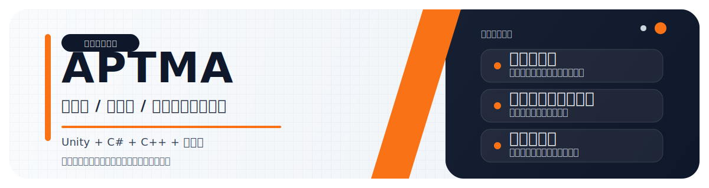

  

  
  
  

  Unity / C# / C++ を軸に、ゲームのプロトタイプ、実用ツール、開発自動化を組み立てています。 
  速く試して、手触りを見て、必要ならすぐ作り直すタイプです。

## CURRENT BUILD

- `Unity gameplay prototypes`  
  小さく動くところまで一気に作って、ゲームループの気持ちよさを先に検証します。
- `Desktop utilities`  
  日常作業を少し速くする Windows ツールを C# で作ります。
- `Web tools and browser extensions`  
  ブラウザ拡張や小規模 Web アプリで、運用や閲覧の摩擦を減らす方向も触っています。

## SELECTED WORKS

- [**DesktopOrganizer**](https://github.com/aptmara/DesktopOrganizer)  
  `C# / Windows` デスクトップ整理ツール
- [**GitTooljp**](https://github.com/aptmara/GitTooljp)  
  `C# / Utility` Git 操作を補助するツール
- [**SimpleZipper**](https://github.com/aptmara/SimpleZipper)  
  `C# / Desktop` 圧縮と解凍に特化したユーティリティ
- [**downloadEx**](https://github.com/aptmara/downloadEx)  
  `JavaScript / Extension` ダウンロード整理を補助するブラウザ拡張
- [**boyscout-tajimi**](https://github.com/aptmara/boyscout-tajimi)  
  `JavaScript / Web` 地域向けサイトと運用導線を持つ Web 制作物
- [**ECS_BACE**](https://github.com/aptmara/ECS_BACE)  
  `C++ / ECS` ECS ベースの C++ 実験系リポジトリ

## SIGNAL

> Build small.  
> Test quickly.  
> Keep the sharp parts.

  
  

## STACK

  

## FOCUS

- ゲームループの手触りを先に作る
- 日常の摩擦を減らすツールを作る
- 必要なら小さく作り直して精度を上げる

## CONTACT

- [@aptmara](https://github.com/aptmara)
