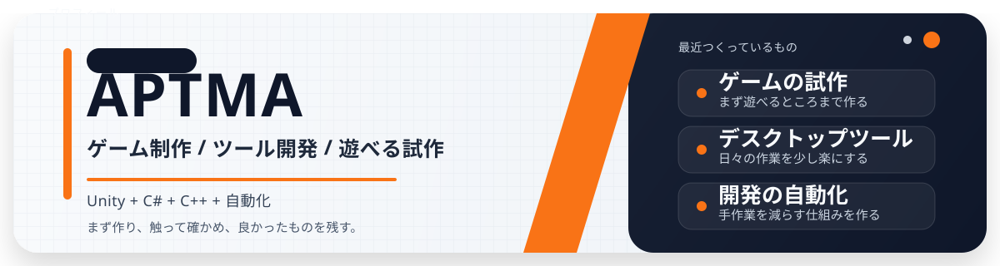

  

<h1 align="center">aptmara</h1>

  <strong>Game Programmer / C++ / C# / Unity</strong>

  ゲームプログラミングを中心に、ゲームシステムやWindows向けツールを開発しています。 
  ECSなどの設計検証、開発支援ツール、ブラウザ拡張なども制作しています。

---

## About

- Game Programming
- C++ / C# / Unity / .NET
- ECS / Game Architecture
- Windows Application Development
- Browser Extensions / Web Tools
- Visual Studio / Git / GitHub

## Featured Projects

  
  

  
  

### Other Projects

- [downloadEx](https://github.com/aptmara/downloadEx) — JavaScript / Browser Extension
- [boyscout-tajimi](https://github.com/aptmara/boyscout-tajimi) — JavaScript / Web

---

# GitHub Activity

## Stats

  <picture>
    <source
      media="(prefers-color-scheme: dark)"
      srcset="https://github-readme-stats.vercel.app/api?username=aptmara&show_icons=true&include_all_commits=true&hide_border=true&theme=github_dark"
    >
    <source
      media="(prefers-color-scheme: light)"
      srcset="https://github-readme-stats.vercel.app/api?username=aptmara&show_icons=true&include_all_commits=true&hide_border=true&theme=default"
    >
    
  </picture>

  <picture>
    <source
      media="(prefers-color-scheme: dark)"
      srcset="https://github-readme-stats.vercel.app/api/top-langs/?username=aptmara&layout=compact&langs_count=8&hide_border=true&theme=github_dark"
    >
    <source
      media="(prefers-color-scheme: light)"
      srcset="https://github-readme-stats.vercel.app/api/top-langs/?username=aptmara&layout=compact&langs_count=8&hide_border=true&theme=default"
    >
    
  </picture>

## Trophies

  <picture>
    <source
      media="(prefers-color-scheme: dark)"
      srcset="https://github-profile-trophy.vercel.app/?username=aptmara&theme=darkhub&no-frame=true&margin-w=5&margin-h=5&column=4"
    >
    <source
      media="(prefers-color-scheme: light)"
      srcset="https://github-profile-trophy.vercel.app/?username=aptmara&theme=flat&no-frame=true&margin-w=5&margin-h=5&column=4"
    >
    
  </picture>

## Contribution Graph

  <picture>
    <source
      media="(prefers-color-scheme: dark)"
      srcset="https://github-readme-activity-graph.vercel.app/graph?username=aptmara&theme=github-compact&hide_border=true&area=true"
    >
    <source
      media="(prefers-color-scheme: light)"
      srcset="https://github-readme-activity-graph.vercel.app/graph?username=aptmara&theme=minimal&hide_border=true&area=true"
    >
    
  </picture>

## Profile Summary

  <picture>
    <source
      media="(prefers-color-scheme: dark)"
      srcset="https://github-profile-summary-cards.vercel.app/api/cards/profile-details?username=aptmara&theme=github_dark"
    >
    <source
      media="(prefers-color-scheme: light)"
      srcset="https://github-profile-summary-cards.vercel.app/api/cards/profile-details?username=aptmara&theme=github"
    >
    
  </picture>

  <picture>
    <source
      media="(prefers-color-scheme: dark)"
      srcset="https://github-profile-summary-cards.vercel.app/api/cards/repos-per-language?username=aptmara&theme=github_dark"
    >
    <source
      media="(prefers-color-scheme: light)"
      srcset="https://github-profile-summary-cards.vercel.app/api/cards/repos-per-language?username=aptmara&theme=github"
    >
    
  </picture>

  <picture>
    <source
      media="(prefers-color-scheme: dark)"
      srcset="https://github-profile-summary-cards.vercel.app/api/cards/most-commit-language?username=aptmara&theme=github_dark"
    >
    <source
      media="(prefers-color-scheme: light)"
      srcset="https://github-profile-summary-cards.vercel.app/api/cards/most-commit-language?username=aptmara&theme=github"
    >
    
  </picture>

  <picture>
    <source
      media="(prefers-color-scheme: dark)"
      srcset="https://github-profile-summary-cards.vercel.app/api/cards/stats?username=aptmara&theme=github_dark"
    >
    <source
      media="(prefers-color-scheme: light)"
      srcset="https://github-profile-summary-cards.vercel.app/api/cards/stats?username=aptmara&theme=github"
    >
    
  </picture>

  <picture>
    <source
      media="(prefers-color-scheme: dark)"
      srcset="https://github-profile-summary-cards.vercel.app/api/cards/productive-time?username=aptmara&theme=github_dark&utcOffset=9"
    >
    <source
      media="(prefers-color-scheme: light)"
      srcset="https://github-profile-summary-cards.vercel.app/api/cards/productive-time?username=aptmara&theme=github&utcOffset=9"
    >
    
  </picture>

## Streak

  <picture>
    <source
      media="(prefers-color-scheme: dark)"
      srcset="https://streak-stats.demolab.com?user=aptmara&theme=github-dark-blue&hide_border=true"
    >
    <source
      media="(prefers-color-scheme: light)"
      srcset="https://streak-stats.demolab.com?user=aptmara&hide_border=true"
    >
    
  </picture>

## Development Metrics

  

## Recent Activity

<!--RECENT_ACTIVITY:start-->

<!--RECENT_ACTIVITY:last_update-->

---

## Tech Stack

**Main**

`C++` `C#` `Unity` `.NET`

**Other**

`Python` `TypeScript` `JavaScript`

**Development**

`Visual Studio` `Git` `GitHub` `Windows`

---

## Playable

### [ならべなおし](https://aptmara.github.io/aptmara/)

散らばったオブジェクトを元の位置へ戻していくミニゲーム。

[Play in Browser →](https://aptmara.github.io/aptmara/)

---

## Contributions

  <picture>
    <source
      media="(prefers-color-scheme: dark)"
      srcset="https://raw.githubusercontent.com/aptmara/aptmara/output/github-contribution-grid-snake-dark.svg"
    >
    <source
      media="(prefers-color-scheme: light)"
      srcset="https://raw.githubusercontent.com/aptmara/aptmara/output/github-contribution-grid-snake.svg"
    >
    
  </picture>

