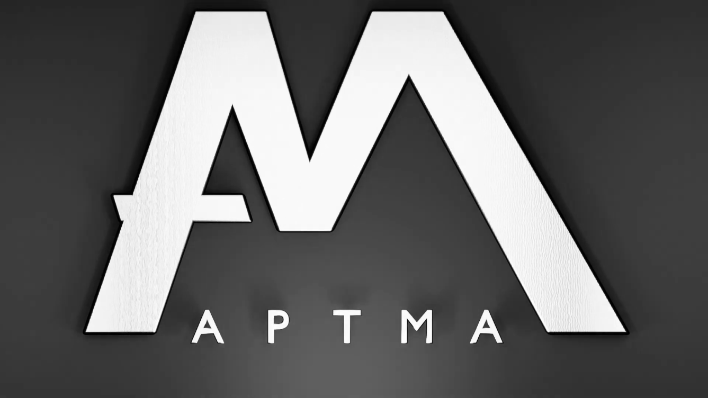

  
  &nbsp;&nbsp;
  

  
    「私はプログラマー」:
    <a href="https://github.com/SAWARATSUKI/KawaiiLogos/tree/main/IamSeries/webp">
      SAWARATSUKI / KawaiiLogos
    </a>
  

<h1 align="center">aptmara</h1>

  <strong>Game Programmer / C++ / C# / Unity</strong>

  ゲームプログラミングを中心に、ゲームシステムやWindows向けツールを開発しています。 
  ECSなどの設計検証、開発支援ツール、ブラウザ拡張なども制作しています。

  <a href="https://portfolio.aptmaserver.uk/">Portfolio</a> |
  <a href="mailto:github@ganba.ro">github@ganba.ro</a>

---

## About

- **Main:** C++ / C# / Unity / .NET
- **Game Development:** Game Programming / ECS / Game Architecture
- **Application:** Windows Application Development
- **Other:** Python / TypeScript / JavaScript
- **Tools:** Visual Studio / Git / GitHub / Windows

---

## Featured Projects

<a href="https://github.com/aptmara/DesktopOrganizer">
  <picture>
    <source
      media="(prefers-color-scheme: dark)"
      srcset="./profile/desktop-organizer-dark.svg"
    >
    <source
      media="(prefers-color-scheme: light)"
      srcset="./profile/desktop-organizer-light.svg"
    >
    
  </picture>
</a>

<a href="https://github.com/aptmara/GitTooljp">
  <picture>
    <source
      media="(prefers-color-scheme: dark)"
      srcset="./profile/gittooljp-dark.svg"
    >
    <source
      media="(prefers-color-scheme: light)"
      srcset="./profile/gittooljp-light.svg"
    >
    
  </picture>
</a>

<a href="https://github.com/aptmara/SimpleZipper">
  <picture>
    <source
      media="(prefers-color-scheme: dark)"
      srcset="./profile/simplezipper-dark.svg"
    >
    <source
      media="(prefers-color-scheme: light)"
      srcset="./profile/simplezipper-light.svg"
    >
    
  </picture>
</a>

<a href="https://github.com/aptmara/ECS_BACE">
  <picture>
    <source
      media="(prefers-color-scheme: dark)"
      srcset="./profile/ecs-bace-dark.svg"
    >
    <source
      media="(prefers-color-scheme: light)"
      srcset="./profile/ecs-bace-light.svg"
    >
    
  </picture>
</a>

### Other Projects

- [downloadEx](https://github.com/aptmara/downloadEx) — JavaScript / Browser Extension
- [boyscout-tajimi](https://github.com/aptmara/boyscout-tajimi) — JavaScript / Web

---

## GitHub Activity

### Stats

<picture>
  <source
    media="(prefers-color-scheme: dark)"
    srcset="./profile/stats-dark.svg"
  >
  <source
    media="(prefers-color-scheme: light)"
    srcset="./profile/stats-light.svg"
  >
  
</picture>

<picture>
  <source
    media="(prefers-color-scheme: dark)"
    srcset="./profile/languages-dark.svg"
  >
  <source
    media="(prefers-color-scheme: light)"
    srcset="./profile/languages-light.svg"
  >
  
</picture>

### Trophies

  <picture>
    <source
      media="(prefers-color-scheme: dark)"
      srcset="./profile/trophy-dark.svg"
    >
    <source
      media="(prefers-color-scheme: light)"
      srcset="./profile/trophy-light.svg"
    >
    
  </picture>

### Development Metrics

  

### Recent Activity

<!--RECENT_ACTIVITY:start-->
1. ⬆️ Pushed undefined commit(s) to [aptmara/CreatorKousien](https://github.com/aptmara/CreatorKousien) 
2. ✔️ Closed issue [#688](https://github.com/aptmara/CreatorKousien/issues/688) in [aptmara/CreatorKousien](https://github.com/aptmara/CreatorKousien) 
3. 💪 Opened PR [#689](undefined) in [aptmara/CreatorKousien](https://github.com/aptmara/CreatorKousien) 
4. ❗️ Opened issue [#688](https://github.com/aptmara/CreatorKousien/issues/688) in [aptmara/CreatorKousien](https://github.com/aptmara/CreatorKousien) 
5. ⬆️ Pushed undefined commit(s) to [aptmara/aptmara](https://github.com/aptmara/aptmara) 
<!--RECENT_ACTIVITY:end-->

<!--RECENT_ACTIVITY:last_update-->
Last Updated: Tuesday, August 25th, 2026, 12:53:11 AM
<!--RECENT_ACTIVITY:last_update_end-->

---

## Contributions

  <picture>
    <source
      media="(prefers-color-scheme: dark)"
      srcset="./profile/github-contribution-grid-snake-dark.svg"
    >
    <source
      media="(prefers-color-scheme: light)"
      srcset="./profile/github-contribution-grid-snake.svg"
    >
    
  </picture>

