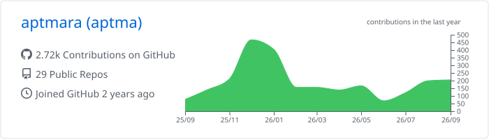
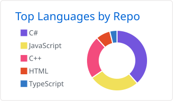
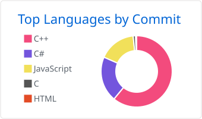
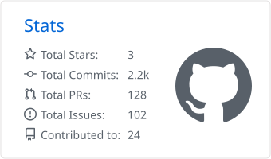
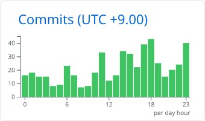

  
  &nbsp;&nbsp;
  

  
    「私はプログラマー」:
    <a href="https://github.com/SAWARATSUKI/KawaiiLogos/tree/main/IamSeries/webp">
      SAWARATSUKI / KawaiiLogos
    </a>
  

<h1 align="center">aptmara</h1>

  <strong>Game Programmer / C++ / C# / Unity</strong>

  ゲームプログラミングを中心に、ゲームシステムやWindows向けツールを開発しています。 
  ECSなどの設計検証、開発支援ツール、ブラウザ拡張なども制作しています。

---

## About

- Game Programming
- C++ / C# / Unity / .NET
- ECS / Game Architecture
- Windows Application Development
- Browser Extensions / Web Tools
- Visual Studio / Git / GitHub

## Featured Projects

<a href="https://github.com/aptmara/DesktopOrganizer">
  <picture>
    <source
      media="(prefers-color-scheme: dark)"
      srcset="./profile/desktop-organizer-dark.svg"
    >
    <source
      media="(prefers-color-scheme: light)"
      srcset="./profile/desktop-organizer-light.svg"
    >
    
  </picture>
</a>

<a href="https://github.com/aptmara/GitTooljp">
  <picture>
    <source
      media="(prefers-color-scheme: dark)"
      srcset="./profile/gittooljp-dark.svg"
    >
    <source
      media="(prefers-color-scheme: light)"
      srcset="./profile/gittooljp-light.svg"
    >
    
  </picture>
</a>

<a href="https://github.com/aptmara/SimpleZipper">
  <picture>
    <source
      media="(prefers-color-scheme: dark)"
      srcset="./profile/simplezipper-dark.svg"
    >
    <source
      media="(prefers-color-scheme: light)"
      srcset="./profile/simplezipper-light.svg"
    >
    
  </picture>
</a>

<a href="https://github.com/aptmara/ECS_BACE">
  <picture>
    <source
      media="(prefers-color-scheme: dark)"
      srcset="./profile/ecs-bace-dark.svg"
    >
    <source
      media="(prefers-color-scheme: light)"
      srcset="./profile/ecs-bace-light.svg"
    >
    
  </picture>
</a>

### Other Projects

- [downloadEx](https://github.com/aptmara/downloadEx) — JavaScript / Browser Extension
- [boyscout-tajimi](https://github.com/aptmara/boyscout-tajimi) — JavaScript / Web

---

# GitHub Activity

## Stats

<picture>
  <source
    media="(prefers-color-scheme: dark)"
    srcset="./profile/stats-dark.svg"
  >
  <source
    media="(prefers-color-scheme: light)"
    srcset="./profile/stats-light.svg"
  >
  
</picture>

<picture>
  <source
    media="(prefers-color-scheme: dark)"
    srcset="./profile/languages-dark.svg"
  >
  <source
    media="(prefers-color-scheme: light)"
    srcset="./profile/languages-light.svg"
  >
  
</picture>

## Trophies

  <picture>
    <source
      media="(prefers-color-scheme: dark)"
      srcset="./profile/trophy-dark.svg"
    >
    <source
      media="(prefers-color-scheme: light)"
      srcset="./profile/trophy-light.svg"
    >
    
  </picture>

## Contribution Graph

  <picture>
    <source
      media="(prefers-color-scheme: dark)"
      srcset="./profile/activity-dark.svg"
    >
    <source
      media="(prefers-color-scheme: light)"
      srcset="./profile/activity-light.svg"
    >
    
  </picture>

## Profile Summary

  <picture>
    <source
      media="(prefers-color-scheme: dark)"
      srcset="./profile/profile-details-dark.svg"
    >
    <source
      media="(prefers-color-scheme: light)"
      srcset="./profile/profile-details-light.svg"
    >
    
  </picture>

<picture>
  <source
    media="(prefers-color-scheme: dark)"
    srcset="./profile/repos-language-dark.svg"
  >
  <source
    media="(prefers-color-scheme: light)"
    srcset="./profile/repos-language-light.svg"
  >
  
</picture>

<picture>
  <source
    media="(prefers-color-scheme: dark)"
    srcset="./profile/commit-language-dark.svg"
  >
  <source
    media="(prefers-color-scheme: light)"
    srcset="./profile/commit-language-light.svg"
  >
  
</picture>

<picture>
  <source
    media="(prefers-color-scheme: dark)"
    srcset="./profile/summary-stats-dark.svg"
  >
  <source
    media="(prefers-color-scheme: light)"
    srcset="./profile/summary-stats-light.svg"
  >
  
</picture>

<picture>
  <source
    media="(prefers-color-scheme: dark)"
    srcset="./profile/productive-time-dark.svg"
  >
  <source
    media="(prefers-color-scheme: light)"
    srcset="./profile/productive-time-light.svg"
  >
  
</picture>

## Streak

  <picture>
    <source
      media="(prefers-color-scheme: dark)"
      srcset="./profile/streak-dark.svg"
    >
    <source
      media="(prefers-color-scheme: light)"
      srcset="./profile/streak-light.svg"
    >
    
  </picture>

## Development Metrics

  

## Recent Activity

<!--RECENT_ACTIVITY:start-->

<!--RECENT_ACTIVITY:last_update-->

---

## Tech Stack

**Main**

`C++` `C#` `Unity` `.NET`

**Other**

`Python` `TypeScript` `JavaScript`

**Development**

`Visual Studio` `Git` `GitHub` `Windows`

---

## Contributions

  <picture>
    <source
      media="(prefers-color-scheme: dark)"
      srcset="./profile/github-contribution-grid-snake-dark.svg"
    >
    <source
      media="(prefers-color-scheme: light)"
      srcset="./profile/github-contribution-grid-snake.svg"
    >
    
  </picture>

